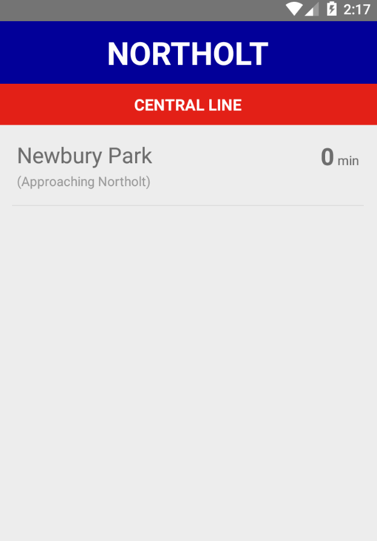

# PockeTable

Personal pocket timetable for frequently used Tube stations in London, showing live departures from London TfL feeds.

Written in **React Native for Android**. Uses Redux as a data layer library.

## DEMO

## TODO
- [ ] Add error handling
- [ ] Improve loading handling
- [ ] Test components (mock native components)
- [ ] Extract hardcoded initial state and stops data to a config file
- [ ] Use Flex for centering loading indicator and 'No departures' label
- [ ] Use Flow
- [ ] Use async keyword instead of promises
- [ ] Add an icon
